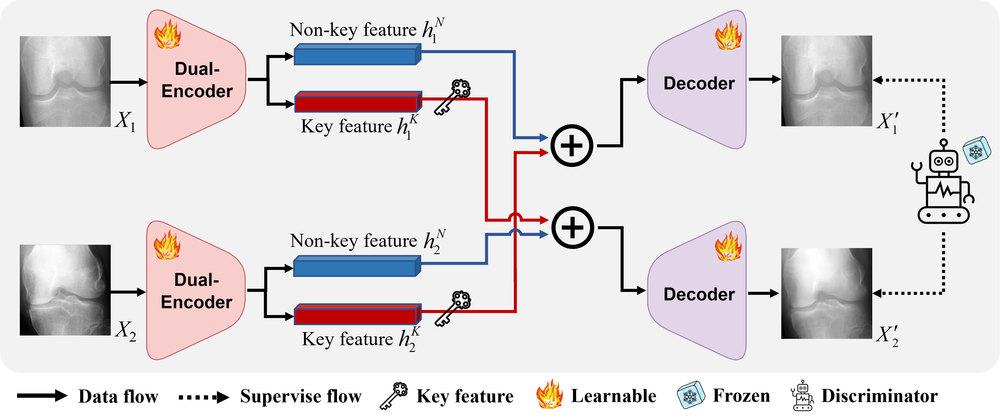

# KECAE: Key-Exchange Convolutional Auto-Encoder for Data Augmentation in Early Knee Osteoarthritis Detection

[](https://arxiv.org/abs/2302.13336)
[](https://opensource.org/licenses/MIT)

This repository contains the official PyTorch implementation for the paper: **"Key-Exchange Convolutional Auto-Encoder for Data Augmentation in Early Knee Osteoarthritis Detection"**.

---

## Project Overview

Knee Osteoarthritis (KOA) is a widespread degenerative joint disease where early detection is crucial for enabling timely interventions to slow its progression. While deep learning models show great promise for automated KOA classification from X-ray images, their development is often severely hampered by the limited availability of large, expertly annotated medical datasets.

To address this data scarcity challenge, we propose the **Key-Exchange Convolutional Auto-Encoder (KECAE)**, a novel AI-driven data augmentation framework. KECAE is designed to generate new, synthetic knee X-ray images that are not only diverse but also maintain clinical and anatomical plausibility. By enriching the training data in this manner, KECAE significantly enhances the performance and generalization capabilities of downstream KOA classification models.


*Figure 1: Flowchart of the proposed KECAE model. The framework disentangles, exchanges, and recombines key pathological features with non-key anatomical backgrounds to synthesize new data.*

## Methodology: The KECAE Framework

The core innovation of KECAE is its unique **key-exchange mechanism**, which operates on the principle of disentangling and recombining distinct features within knee X-ray images.

### 1. Key and Non-Key Feature Disentanglement

We conceptualize X-ray image features into two categories:
* **Key Features ($h^K$)**: These are the discriminative pathological indicators most critical for classification into a specific Kellgren-Lawrence (KL) grade. Examples include the degree of joint space narrowing (JSN) and the size of osteophytes.
* **Non-Key Features ($h^N$)**: This represents the underlying anatomical background of the knee joint, which carries less discriminative weight for the classification task.

Crucially, this separation is not predefined but is learned by the model during training, guided by a specialized loss function.

### 2. Model Architecture

The KECAE model consists of three main components:
1.  **Dual-Path Encoder**: Comprises two identical but non-parameter-sharing Convolutional Neural Networks (CNNs). For a single input image $X$, it produces two distinct latent vectors: a key feature vector $h^K$ and a non-key feature vector $h^N$.
2.  **Decoder**: A deconvolutional neural network (DCNN) that reconstructs an image from a given latent vector.
3.  **Discriminator**: A pre-trained, fixed-weight SOTA classification model that supervises the feature exchange process to ensure clinical validity.

### 3. The Key-Exchange Mechanism

During training, the model processes two input images simultaneously ($X_1$ from a healthy class, e.g., KL-0, and $X_2$ from an osteoarthritic class, e.g., KL-2).
1.  The encoder extracts four feature vectors: $(h_1^N, h_1^K)$ from $X_1$ and $(h_2^N, h_2^K)$ from $X_2$.
2.  The **key features are swapped**: $h_1^K$ is exchanged with $h_2^K$.
3.  **New latent vectors are formed**: Two new composite vectors are created through element-wise addition:
    * $h_1' = h_1^N + h_2^K$ (Healthy background + OA key features)
    * $h_2' = h_2^N + h_1^K$ (OA background + Healthy key features)
4.  The decoder then generates two new, synthetic key-exchanged images, $X_1'$ and $X_2'$, from these composite vectors.

### 4. Hybrid Loss Function

To achieve robust feature disentanglement and high-quality image generation, we employ a hybrid loss function:
$J_{hybrid} = J_{MSE} + \lambda_1 J_{SUP} + \lambda_2 J_{LDA}$

* **Reconstruction Loss ($J_{MSE}$)**: A standard Mean Squared Error loss that ensures the autoencoder can accurately reconstruct the original images from their non-exchanged latent vectors.
* **Supervision Loss ($J_{SUP}$)**: A Cross-Entropy loss from the pre-trained discriminator. It verifies that the generated key-exchanged images correspond to their new, swapped labels (e.g., $X_1'$ should be classified as KL-2).
* **Distance Loss ($J_{LDA}$)**: Implemented using Fisher's Linear Discriminant Analysis (LDA), this loss maximizes the distance between the key ($h^K$) and non-key ($h^N$) feature vectors, forcing the model to learn a meaningful and robust separation.

## Key Findings & Results

KECAE was rigorously evaluated on two large, public datasets (OAI and MOST) and demonstrated state-of-the-art performance.

* **Superior Generative Quality**: In quantitative comparisons using metrics like Fréchet Inception Distance (FID) and Kernel Inception Distance (KID), KECAE significantly outperformed leading GAN-based models, achieving the best scores (FID: 19.60, KID: 10.11). Qualitatively, its outputs showed higher anatomical fidelity and fewer visual artifacts.
* **Effective Data Augmentation**: Augmenting training sets with KECAE-generated data provided the most substantial performance increase across seven different downstream classifier architectures, elevating a SOTA model's accuracy to **90.84%**.
* **Clinical Validity**: A blinded reader study involving four board-certified radiologists confirmed the clinical utility and realism of our synthetic images. [cite_start]KECAE-generated images achieved the highest average diagnostic accuracy (**86.50%**) and subjective realism score (**4.23/5.0**) among all generative methods.
* **Broad Generalizability**: The effectiveness of our augmentation strategy was confirmed across the full spectrum of KOA severity (KL grades 0-4) on both the OAI and MOST datasets, proving its robustness and wide applicability.

## Installation

**Clone the repository:**
    ```bash
    git clone [https://github.com/ZWang78/KECAE.git](https://github.com/ZWang78/KECAE.git)
    cd KECAE
    ```

## Usage

1.  **Data Preparation:**
    * Download the required dataset (e.g., from the Osteoarthritis Initiative - OAI).
    * Organize your data into a root directory (e.g., `./OAI_m/`). The `KneeGradingDataset` class expects a specific CSV file (`paper_0_2_100000.csv`) in this directory to define the image pairs for training.
    * Each row in the CSV file must be in the format: `image_path_kl0,label_0,image_path_kl2,label_2`.

2.  **Training:**
    * Execute the main training script:
    ```bash
    python main.py
    ```
    * The script will begin the training process, displaying loss values for each batch.
    * Model checkpoints (`.pth` files for the encoder, decoder, and discriminator) will be saved periodically in the root directory.

## Citation

If you find this work useful in your research, please consider citing our paper:

```bibtex
@article{wang2023key,
  title={Key-exchange convolutional auto-encoder for data augmentation in early knee osteoarthritis classification},
  author={Wang, Zhe and Chetouani, Aladine and Jennane, Rachid},
  journal={arXiv preprint arXiv:2302.13336},
  year={2023}
}